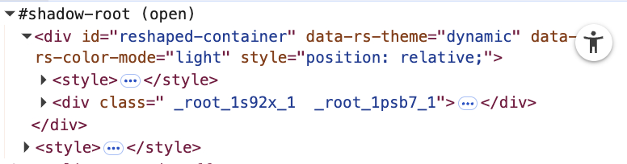

## The Problem: Closed Shadow DOM

When testing iFrames with Playwright (which, unlike Cypress, has excellent iframe support), you may encounter a particularly tricky scenario: the **closed Shadow DOM**. In your browser's DevTools, it looks like this:


Notice the `#shadow-root (closed)` label. This is where things get interesting.

## Why Shadow DOM is Closed

The Shadow DOM provides encapsulation for web components, isolating their internal structure from the rest of the page. When a Shadow DOM is set to `closed` mode, it's done for security and encapsulation reasons:

- **Security**: Prevents external JavaScript from accessing or manipulating internal component structure
- **Encapsulation**: Ensures component internals remain private and protected from outside interference
- **API Contract**: Forces interaction through the component's public API only

While these are valid architectural decisions, they create a challenge for automated testing where you need to verify the component's internal state.

## The Testing Challenge

When you try to use Playwright to interact with elements inside a closed Shadow DOM, you'll encounter errors because Playwright cannot pierce through the closed boundary. The DOM query simply fails to find the elements you're looking for.

For most test engineers, this seems like game over. However, there's a clever workaround.

## The Solution: Force Open Shadow DOM

The key insight is that we can intercept the Shadow DOM creation at the browser level and force all Shadow DOMs to be created in `open` mode instead:



Notice the difference: `#shadow-root (open)` allows Playwright to access the internal elements.

## Implementation

Here's the function that makes this possible:

```typescript
async function forceOpenShadowDOM(page: Page) {
  await page.addInitScript(() => {
    const orig = Element.prototype.attachShadow
    Element.prototype.attachShadow = function (init) {
      // Force mode: 'open' even if the component requests 'closed'
      return orig.call(this, { ...init, mode: 'open' })
    }
  })
}
```

This function uses Playwright's `addInitScript()` to inject JavaScript that runs before any page scripts load. It:

1. **Saves the original** `attachShadow` method
2. **Overrides** `Element.prototype.attachShadow`
3. **Intercepts** all Shadow DOM creation calls
4. **Forces** the mode to `'open'` regardless of what the component requests
5. **Maintains** all other initialization options

## Usage in Tests

Add this to your test setup to apply it to all tests:

```typescript
test.beforeEach(async ({ page }) => {
  await forceOpenShadowDOM(page)
  // Your test setup continues...
})
```

Alternatively, for specific tests:

```typescript
test('should interact with shadow DOM elements', async ({ page }) => {
  await forceOpenShadowDOM(page)
  await page.goto('https://your-app.com')
  
  // Now you can access shadow DOM elements normally
  await page.locator('#shadow-host').locator('button').click()
})
```

## Important Considerations

- **Test Environment Only**: This technique should only be used in testing environments. It fundamentally changes how the application behaves.
- **Timing Matters**: Call `forceOpenShadowDOM()` before navigating to your page, as it needs to inject the script before the page loads.
- **iFrame Support**: This works within iFrames as well, making it perfect for testing embedded components.

This approach gives you the testing capability you need while respecting that closed Shadow DOM serves legitimate purposes in production code.

